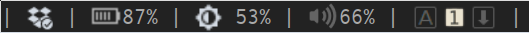

## My Awesome WM widgets

So, if you decide to try some of mine widgets you could just copy them to your config folder and place in **rc.lua**:

```lua
local config_path   = awful.util.getdir("config")
package.path        = config_path .. "/path/to/folder/with/<widget>.lua;"        .. package.path

                      require("dropbox")
                      require("backlight")
                      require("keylock-icons")
```

### List

- [backlight](backlight) 
- [dropbox](dropbox) 
- [keylock-icons](keylock-icons) 


### Screenshot



